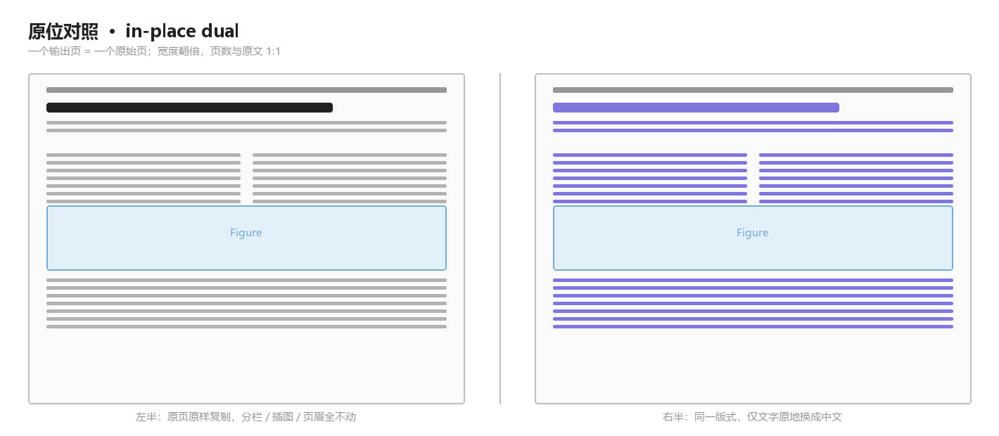
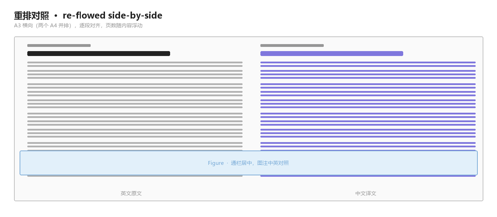

# academic-pdf-bilingual

> 把一篇学术 PDF 变成**左原文 / 右译文**的双语版，原排版不动。
> Turn a scholarly PDF into a bilingual edition: original on the left, Chinese on the right, layout untouched.

一个 [WorkBuddy](https://www.codebuddy.cn/docs/workbuddy/Overview) / Claude 风格的 Agent Skill。给它一篇论文 PDF，它输出一份宽度翻倍的双语 PDF——左边是原页逐像素复制，右边是同一页、同一版式，只把文字换成了中文。



---

## 目录

- [它解决什么问题](#它解决什么问题)
- [两种版式](#两种版式)
- [环境要求](#环境要求)
- [安装](#安装)
- [使用](#使用)
- [输出规格](#输出规格)
- [可调参数](#可调参数)
- [工作原理](#工作原理)
- [已知限制](#已知限制)
- [常见问题](#常见问题)
- [项目结构](#项目结构)
- [License](#license)

---

## 它解决什么问题

现成的 PDF 翻译工具大多只有两条路：要么把版面推倒重排（图表跑位、公式错乱），要么整页截图后贴译文（不可检索、无法复制）。这个 skill 走第三条路——**插入式原位替换**：

- 原文页**一个像素都不动**。分栏、页眉页脚、水印、插图、公式、参考文献全在原位。
- 译文页**沿用完全相同的坐标**，逐块把英文换成中文，自动缩放到原来的文本框里。
- 插图因为整页被复制，左右各出现一份；**图内标注保持英文**（热图色标、坐标轴、流程框标签）。
- 输出页数与原文 **1:1**，读者可以左右对着看，不会读丢。

适合：论文精读、组会分享、给不做本方向的同事/导师快速过一遍、需要拿纸质版对照阅读。

## 两种版式

### 原位对照（默认）

见上图。左半 = 原页原样，右半 = 同版式中文。宽度翻倍（如 612×783pt → 1224×783pt），页数不变。

### 重排对照（备选）



A3 横向（420×297mm = 两个 A4 并排），左英文右中文，**逐段对齐**成一行一行，插图通栏居中。适合逐段精读，页数会随内容浮动。

两种模式共用同一套解析与翻译产物，只是最后一步不同。

## 环境要求

| | 要求 |
| --- | --- |
| Python | 3.9+ |
| 必需库 | `PyMuPDF`（导入名 `fitz`） |
| 中文字体 | 系统自带即可：Windows 的 SimSun/SimHei、macOS 的 Songti、Linux 的 Noto CJK。找不到会自动回退到 PyMuPDF 内置 CJK 字体 |
| 重排模式额外需要 | Chrome 或 Edge（用于 HTML 打印成 PDF） |
| 不需要 | 任何翻译 API、任何联网调用 |

```bash
pip install pymupdf
```

## 安装

Skill 本质就是一个文件夹，放到技能库目录即可生效。

**方式一 · 一键安装（推荐）**

```bash
git clone https://github.com/<你的用户名>/academic-pdf-bilingual.git
cd academic-pdf-bilingual
python install.py
```

`install.py` 会把技能复制到你本机的技能库：

| 平台 | 目标目录 |
| --- | --- |
| 通用 | `~/.workbuddy/skills/academic-pdf-bilingual/` |
| 项目级（可选） | `<项目>/.workbuddy/skills/academic-pdf-bilingual/` |

**方式二 · 手动复制**

把整个文件夹拷到 `~/.workbuddy/skills/` 下，确保 `SKILL.md` 就在技能目录的第一层：

```
~/.workbuddy/skills/academic-pdf-bilingual/
├── SKILL.md          <- 必须在这一层
├── scripts/
└── references/
```

**方式三 · 项目级安装**

只想在某个项目里用，就放到该项目的 `.workbuddy/skills/` 下，随仓库一起提交，团队共享。

装好后**新开一个会话**，让 Agent 做"把这篇论文翻成中英对照"之类的请求，它就会自动加载这个技能。

## 使用

主要用法是**自然语言驱动**——直接跟 Agent 说：

> 把 `~/papers/xxx.pdf` 翻译成中英对照版，保持原排版

Agent 会按 `SKILL.md` 里的五步走：解析 → 定术语与译员角色 → 分批翻译 → 质检 → 合成。

也可以在命令行手动跑完整条流水线：

```bash
# 1. 解析（原位模式：保持 PDF 的自然块，不做跨栏合并）
python scripts/extract.py paper.pdf --outdir work --profile inplace --no-figure-crops

# 2. 写 work/translations.json（meta / verbatim / terms / blocks）
#    然后用你惯用的方式把 work/to_translate.txt 里的块翻译成中文

# 3. 质检
python scripts/check.py --workdir work

# 4. 合成
python scripts/compose.py --workdir work --out paper_zh-dual.pdf
```

重排模式把第 1 步换成 `--profile reflow`，第 4 步换成 `python scripts/render.py --workdir work`。

## 输出规格

**原位对照**

- 页面 = 原文两倍宽 × 原文高（612×783pt → 1224×783pt = 432×276mm）
- 页数与原文 1:1
- 左半原页逐像素保留
- 右半同版式：正文 / 标题 / 图注为中文；参考文献、作者姓名、DOI、图内标注保持英文
- 中文按每个原文本框自适应缩放，不会溢出到相邻块
- 文字可复制、可检索（矢量文字 + 系统 TTF 子集嵌入）

**重排对照**

- A3 横向 420×297mm，逐段对齐
- 插图通栏居中（高度上限 218mm），图注中英对照
- 参考文献通栏保留原文

## 可调参数

写进 `translations.json` 的 `options`，改完只需重跑合成步骤，**不用重新解析或翻译**。

| 选项 | 默认 | 模式 | 说明 |
| --- | --- | --- | --- |
| `line_height` | `1.42` | 原位 | 中文行距倍数 |
| `max_scale` | `1.10` | 原位 | 中文相对原字号的最大放大倍数 |
| `min_scale` | `0.72` | 原位 | 缩到这个比例仍放不下就会溢出，说明该压缩译文 |
| `gap` | `0` | 原位 | 左右两半之间的间隙（pt），0 = 紧贴 |
| `divider` | `true` | 原位 | 中线是否画一条淡分隔线 |
| `keep_heading_color` | `true` | 原位 | 标题沿用原文配色，正文强制黑 |
| `page_width` / `page_height` | `420mm` / `297mm` | 重排 | 页面尺寸 |
| `en_size` / `cn_size` | `8.6pt` / `9.0pt` | 重排 | 正文字号 |
| `figure_max_height` | `218mm` | 重排 | 单张插图高度上限 |

## 工作原理

```
PDF ──► extract.py ──► blocks.json ──► [分批翻译] ──► translations.json
                            │                              │
                            └──────────► compose.py ◄──────┘
                                              │
                                              ▼
                                     双语 PDF（原位对照）
```

几个关键设计：

**分栏阅读顺序**：以"全宽元素"（通栏标题、图区、图注）为分段符切开页面，段内按 `(栏号, y)` 排序。这比单纯按 y 排序可靠得多。

**图区识别**：不依赖 `get_image_info()` 的 bbox——Elsevier 等出版商的校样里这些坐标经常超出页面。改用"图注上方那段没有正文段落的空白带即为图区"，再用矢量图形和位图的 ink 范围收紧边界。落在图区里的文字块自动归为图形的一部分，不参与翻译。

**跨栏断词**：PDF 提取会把 `machine` 断成 `ma-` / `chine`，甚至把连字符丢掉变成 `ma` / `chine`。脚本用一张 100+ 条的复合词保护表（`multi-user`、`AI-assisted` 等）决定断点处该保留还是丢掉连字符。

**原位回填**：`show_pdf_page` 把原页贴到左右两半，右半按块矩形填白后回填中文。填白的底色是从原页采样出来的，所以在有色背景上也不会留白疤；擦除矩形会按图区收缩，绝不啃到插图。中文用 `fit_text()` 逐 0.2pt 试算，取能塞进原框的最大字号。

**字体子集化**：SimSun 全量嵌入约 10MB+，`subset_fonts()` 只留用到的字形，实测把成品从 20.8MB 压到 7.0MB。

## 已知限制

- **扫描件不适用**。需要 PDF 有文字层。纯图片的 PDF 请先做 OCR。
- **图内文字不翻译**。这是刻意的：重绘热图色标、坐标轴、流程框极易错位，还会破坏数据可追溯性。
- **右半会留白**。中文比英文短，原位模式不改版面，短译文的框下方会空出来。这是该格式的固有特征。
- **分栏切断的段落会拆成两段译**。读者按"左栏末 → 右栏首"顺序读，两段能接上；原文断在半个词上时中文也照做。
- **作者姓名保留拉丁原文**。中文名用字无法从拼音反推，猜错等于伪造，所以不做转换。
- **复杂表格**。跨页大表的单元格可能被拆成多个块，译文会落在各自格子里，可读但未必理想。
- **不是逐行对照**。原位模式保证的是"版式一致"，不是"每行原文对着每行译文"。

## 常见问题

| 现象 | 原因 | 处理 |
| --- | --- | --- |
| 右半某段中文很小 | 译文比原文长，触到 `min_scale` | 压缩译文，或调低 `min_scale`（别低于 0.6，否则难读） |
| 中文盖住插图 | 擦除矩形切进图区 | 已按 `figure_zones` 收缩；若仍发生，检查该页图区是否漏识别 |
| 某块完全没被替换 | 在 `verbatim` 里，或本就无译文 | 预期行为；参考文献和作者名就是如此 |
| 中文显示为方块 | 没找到中文 TTF | 装一个中文字体，或确认 `compose.py` 的 `FONT_CANDIDATES` 覆盖了本机路径 |
| 段落在分栏处读不通 | 片段没在同一处断开 | 让两段译文在原文断开处也断开 |
| 译文整体错位一格 | 拿了旧的待译清单 | 翻译前必须从 `blocks.json` 重新导出清单，块 ID 会随切分规则变化 |
| 输出体积过大 | 字体全量嵌入 | 已内置 `subset_fonts()`；若仍大，看它是否报错 |
| 重排模式插图撑爆一页 | 缺高度上限 | 调小 `figure_max_height` |

## 项目结构

```
academic-pdf-bilingual/
├── SKILL.md                          # 技能主指令，Agent 读这个
├── install.py                        # 一键安装到技能库
├── README.md
├── LICENSE
├── docs/
│   ├── dual-layout.png
│   ├── reflow-layout.png
│   └── make_schematic.py             # 重新生成上面两张图
├── scripts/
│   ├── extract.py                    # PDF → 结构化块模型
│   ├── compose.py                    # 原位对照合成（默认）
│   ├── render.py                     # 重排对照合成（备选）
│   └── check.py                      # 译稿质检
└── references/
    ├── translator-personas.md        # 15 个学科 → 译员角色映射 + 提示词模板
    └── translation-rules.md          # 术语 / 数字 / 交叉引用 / 语体规范
```

## License

[MIT](LICENSE)

---

## English summary

An Agent Skill that turns a scholarly PDF into a bilingual edition. It produces one output page per source page at double width: the untouched original on the left, and the same page with Chinese substituted in place on the right. Columns, figure positions, headers and captions keep their original coordinates, the page count matches the source 1:1, and figures are copied into both halves with their internal labels left in English. A re-flowed variant (English and Chinese in aligned side-by-side rows on A3 landscape) is also included.

Requires Python 3.9+ and PyMuPDF. The re-flow layout additionally needs Chrome or Edge. No translation API and no network calls. Copy the folder into `~/.workbuddy/skills/` or run `python install.py`.
